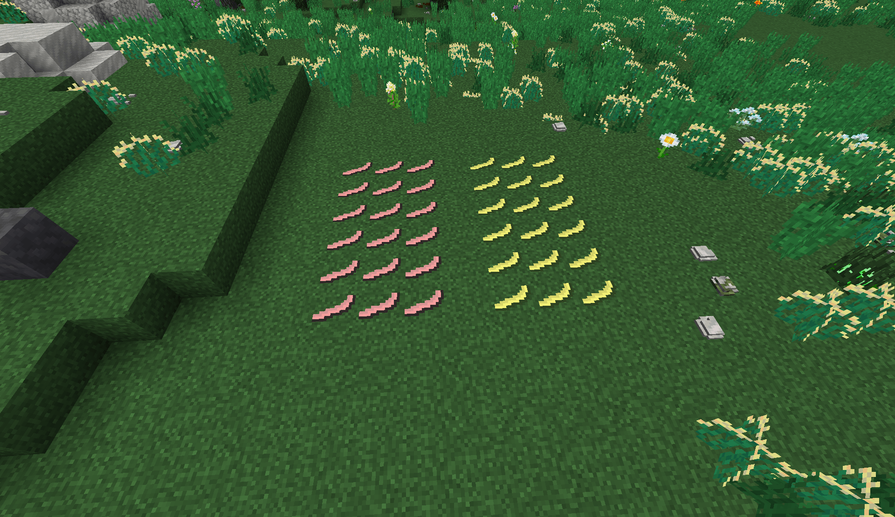

### About
Better Stone Age is a TerraFirmaCraft addon that enhances the TerraFirmaCraft early game by adding more things to do that do not require copper tools.

### Links
[Download on Curseforge](https://www.curseforge.com/minecraft/mc-mods/tfc-better-stone-age)
### Features
|  |
| ------ |
| *Sinew in its dried and undried forms* |
- A tiered tool binding system for stone tools, in which better bindings give bonuses to the tools they're used to craft
- Flint and bone tools
- Alternative arrowhead making
- Achulean handaxes as a way to quickly make tools on the fly
- Sinew as a string alternative
- Stone age dyed ceramics
	- The ability to dye ceramic jugs and pots at all
- The ability to recycle fired ceramics
- A Decorated Pot making system
- Extensive in-game documentation